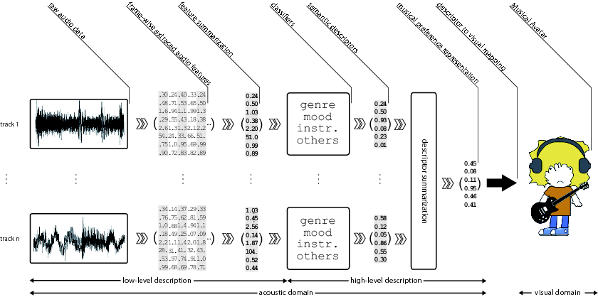
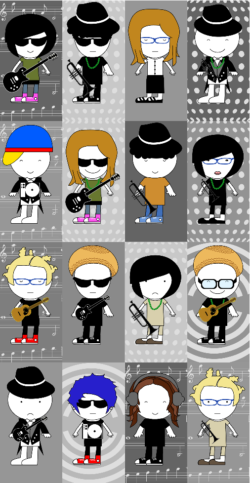

# The Musical Avatar

In this project we address visualization of musical preferences of a listener by inferring their semantic representation from audio and creating a humanoid cartoon-like character – the Musical Avatar - based on it. The visualization is generated from a collection of music tracks provided by a user as an example of her/his musical preferences. We automatically compute different acoustic features and apply pattern recognition methods to infer a set of semantic descriptors for each track in the collection. Next, we summarize these track-level semantic descriptors, obtaining a user profile. Finally, we map this collection-wise description to the visual domain by creating a humanoid cartoony character that represents the user’s musical preferences.

These are some examples of Musical Avatars: 

## Scientific publications

- Bogdanov, D., Haro M., Fuhrmann F., Xambó A., Gómez E., Herrera P., et al. (2013). [Semantic content-based music recommendation and visualization based on user preference examples](https://dx.doi.org/10.1016/j.ipm.2012.06.004). Information Processing & Management. 49(1).

- Bogdanov, D., Haro M., Fuhrmann F., Xambó A., Gómez E., & Herrera P. (2011). [A Content-based System for Music Recommendation and Visualization of User Preferences Working on Semantic Notions](http://hdl.handle.net/10230/47003). 9th International Workshop on Content-based Multimedia Indexing (CBMI 2011).

- Haro, M., Xambó A., Fuhrmann F., Bogdanov D., Gómez E., & Herrera P. (2010). [The Musical Avatar - A visualization of musical preferences by means of audio content description](http://hdl.handle.net/10230/47005). 5th Audio Mostly Conference: A Conference on Interaction with Sound (AM 2010).

